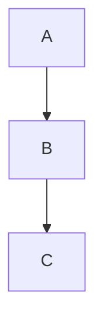
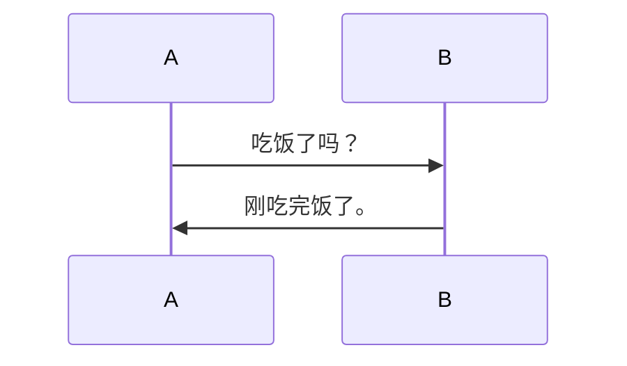
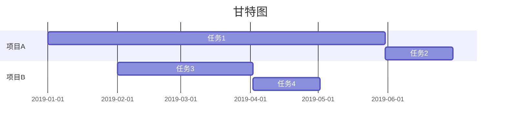

鑫鑫又给大家带来了满满的干货~

MarkDown编辑器下载请自行去谷歌~

## 1.文本框

```markdown
```tex

Hello World
```

```
效果如下：

```tex
Hello World
```

## 2.表格

### 一、基本用法

```markdown
First Header | Second Header | Third Header
------------ | ------------- | ------------
Content Cell | Content Cell  | Content Cell
Content Cell | Content Cell  | Content Cell
```

效果如下：

| First Header | Second Header | Third Header |
| ------------ | ------------- | ------------ |
| Content Cell | Content Cell  | Content Cell |
| Content Cell | Content Cell  | Content Cell |

### 二、进阶用法

```markdown
First Header | Second Header | Third Header |
:----------- | :-----------: | -----------: |
Left         | Center        | Right        |
Left         | Center        | Right        |
```

效果如下：

| First Header | Second Header | Third Header |
|:------------ |:-------------:| ------------:|
| Left         | Center        | Right        |
| Left         | Center        | Right        |

## 3.数学公式

首先确保你的Markdown编辑器支持并且已经可以使用LateX语法

如果想让公式插在文字中，可以使用`$`，例如`$x^2$`，就是$x^2$。

### 一、上下标

> ^ 表示上标, _ 表示下标。如果上下标的内容多于一个字符，需要用 {} 将这些内容括成一个整体。上下标可以嵌套，也可以同时使用。

```latex
x^{y^z}=(1+{\rm e}^x)^{-2xy^w}
```

效果如下：

$$
x^{y^z}=(1+{\rm e}^x)^{-2xy^w}
$$

### 二、括号与分隔符

> ()、[] 和 \| 表示符号本身，使用 {} 来表示 {} 。当要显示大号的括号或分隔符时，要用 \left 和 \right 命令。

| 输入      | 显示  | 输入      | 显示  |
|:-------:|:---:|:-------:|:---:|
| \langle | ⟨   | \rangle | ⟩   |
| \lceil  | ⌈   | \rceil  | ⌉   |
| \lfloor | ⌈   | \rfloor | ⌋   |
| \lbrace | {   | \rbrace | }   |

```latex
f(x,y,z) = 3y^2z \left( 3+\frac{7x+5}{1+y^2} \right)
```

效果如下：

$$
f(x,y,z) = 3y^2z \left( 3+\frac{7x+5}{1+y^2} \right)
$$

### 三、分数

> 通常使用 \frac {分子} {分母} 命令产生一个分数，分数可嵌套。

> 便捷情况可直接输入 \frac ab 来快速生成一个↓


> 如果分式很复杂，亦可使用 分子 \over 分母 命令，此时分数仅有一层。

```latex
\frac{a-1}{b-1} \quad and \quad {a+1\over b+1}
```

效果如下：

$$
```latex
\frac{a-1}{b-1} \quad and \quad {a+1\over b+1}
```
$$

### 四、开方

> 使用 \sqrt [根指数，省略时为2] {被开方数} 命令输入开方。

```latex
\sqrt{2} \quad and \quad \sqrt[n]{3}
```

效果如下：

$$
\sqrt{2} \quad and \quad \sqrt[n]{3}
$$

### 五、省略号

> 数学公式中常见的省略号有两种，\ldots 表示与文本底线对齐的省略号，\cdots 表示与文本中线对齐的省略号。

```latex
f(x_1,x_2,{\ldots} ,x_n) = x_1^2 + x_2^2 + {\cdots} + x_n^2
```

效果如下：

$$
f(x_1,x_2,{\ldots} ,x_n) = x_1^2 + x_2^2 + {\cdots} + x_n^2
$$

### 六、矢量

> 使用 \vec{矢量} 来自动产生一个矢量。也可以使用 \overrightarrow 等命令自定义字母上方的符号。

```latex
\overleftarrow{x \cdot y} \quad and \quad \overleftrightarrow{xy} \quad and \quad \overrightarrow{xy}
```

效果如下：

$$
\overleftarrow{x \cdot y} \quad and \quad \overleftrightarrow{xy} \quad and \quad \overrightarrow{xy}
$$

### 七、矩阵

#### Ⅰ 无框矩阵

> 在开头使用 begin{matrix}，在结尾使用 end{matrix}，在中间插入矩阵元素，每个元素之间插入 & ，并在每行结尾处使用 \ 。

```latex
\begin{matrix}

1 & x & x^2 \\

1 & y & y^2 \\

1 & z & z^2 \\

\end{matrix}
```

效果如下：

$$
```latex
\begin{matrix}

1 & x & x^2 \\

1 & y & y^2 \\

1 & z & z^2 \\

\end{matrix}
```
$$

#### Ⅱ 边框矩形

> 在开头将 matrix 替换为 pmatrix bmatrix Bmatrix vmatrix Vmatrix。

```latex
\begin{matrix} 1 & 2 \\ 3 & 4 \\ \end{matrix}

\begin{pmatrix} 1 & 2 \\ 3 & 4 \\ \end{pmatrix}

\begin{bmatrix} 1 & 2 \\ 3 & 4 \\ \end{bmatrix}

\begin{Bmatrix} 1 & 2 \\ 3 & 4 \\ \end{Bmatrix}

\begin{vmatrix} 1 & 2 \\ 3 & 4 \\ \end{vmatrix}

\begin{Vmatrix} 1 & 2 \\ 3 & 4 \\ \end{Vmatrix}
```

效果如下：

$$
\begin{matrix} 1 & 2 \\ 3 & 4 \\ \end{matrix}

\begin{pmatrix} 1 & 2 \\ 3 & 4 \\ \end{pmatrix}

\begin{bmatrix} 1 & 2 \\ 3 & 4 \\ \end{bmatrix}

\begin{Bmatrix} 1 & 2 \\ 3 & 4 \\ \end{Bmatrix}

\begin{vmatrix} 1 & 2 \\ 3 & 4 \\ \end{vmatrix}

\begin{Vmatrix} 1 & 2 \\ 3 & 4 \\ \end{Vmatrix}
$$

**PS**：输入`<br>`，可以实现加入空行。

### 八、在Github上使用LateX语法

了解了这么多LateX，在Github上不能敲，这可咋整？

所以这个时候就要请出[Codecogs](/goto?link=https://latex.codecogs.com/)了！

但进去一看，emm...这好像也没啥用啊！


不不不，你需要调用另外一个Codecogs网址：https://latex.codecogs.com/gif-latex? + LateX语法代码，然后用Markdown图片语法显示。

例如：

```latex

```

效果如下：


哦对了，本博客已经有LateX的插件了，所以不需要使用Codecogs。

**PS**：空格需要替换为`%20`

## 4.代码

```markdown
```python

print('Hello,World!')
```

```
效果如下：

```python
print('Hello,World!')
```

## 5.内联图片

```markdown

```

效果如下：


## 6.超链接

```markdown
[MacWinLin工作室博客](https://macwinlin.github.io)
```

效果如下：

[MacWinLin工作室博客](/goto?link=https://macwinlin.github.io)

## 7.待办列表

```markdown
- [x] 上学

- [ ] 不上学
```

效果如下：

- [x] 1

- [ ] 2

## 8.标题

```markdown
# 一级标题

## 二级标题

### 三级标题

#### 四级标题

##### 五级标题

###### 六级标题
```

效果……懒得试了请自行访问[蓝奏云链接](/goto?link=https://xinxinf.lanzouq.com/iibwsxqmk9a)。

## 9.段落

没错，你看到的这行字也是段落。

```markdown
一个段落
```

效果如下：

一个段落

没错，就这么简单。

### 注意事项

换行请在两个段落之间空一行，或在段落后加2个空格；

否则两行将被识别为一行。

## 10.加粗、斜体和删除线

越来越像复杂版Word了……

### 一、加粗

```markdown
This is **bold**.
```

效果如下：

This is **bold**.

### 二、斜体

```markdown
This is *italic*.
```

效果如下：

This is *italic*.

**不过这样也是可以的**：

```markdown
This is _italic_
```

效果和上面的一模一样，选择哪个看你自己。

### 三、斜体并加粗

```markdown
This is **_bold and italic_*.
```

效果如下：

This is **_bold and italic_**.

**注意**：`***bold and italic***`也是可行的，但建议使用`**_bold and italic_**`，除非这个用不了。

### 四、删除线

```markdown
This is ~~delete~~
```

效果如下：

This is ~~delete~~.

## 11.列表

列表分为有序列表和无序列表。

### 一、有序列表

要创建有序列表，请在每个列表项前添加数字并紧跟一个英文句点。 数字不必按数学顺序排列，但是列表应当以数字 1 起始。

```markdown
1. First item

2. Second item

3. Third item

4. Fourth item
```

效果如下：

1. First item

2. Second item

3. Third item

4. Fourth item

### 二、无序列表

要创建无序列表，请在每个列表项前面添加破折号 (-)、星号 (*) 或加号 (+) 。 缩进一个或多个列表项可创建嵌套列表。

```markdown
- First item

- Second item

- Third item

- Fourth item
```

效果如下：

- First item

- Second item

- Third item

- Fourth item

## 12.引用

```markdown
> Number One
```

效果如下：

> Number One

### 一、多个段落一起引用

可以一起引用多个段落。

```markdown
> First item
>
> Second item
```

效果如下：

> First item
> 
> Second item

### 二、嵌套

引用也可以嵌套，在嵌套的段落前加上\>\>即可

```markdown
> First item
>
> > Second item
```

效果如下：

> First item
> 
> > Second item

### 三、引用其他元素

引用可以包含其他 Markdown 格式的元素。 并非所有元素都可以使用，你需要进行实验以查看哪些元素有效。

```markdown
> #### 标题
>
> - Frist item
> - Second item
> - Third item
>
> *italic*&**bold**
>
> ***bold and italic***
```

效果如下：

> #### 标题
> 
> - Frist item
> - Second item
> - Third item
> 
> *italic*&**bold**
> 
> ***bold and italic***

## 13.分隔线

要创建分隔线，请在单独一行上使用三个或多个星号 (\*\*\*)、破折号 (\-\-\-) 或下划线 (\_\_\_) ，并且不能包含其他内容。

```markdown
*********

---------

_________
```

效果如下：

*********

---------

_________

## 14.转义字符

要显示原本用于格式化 Markdown 文档的字符，请在字符前面添加反斜杠字符 \ 。

```markdown
\* 如果没有反斜杠，这是一个无序列表。
```

效果如下：

\* 如果没有反斜杠，这是一个无序列表。

### 可做转义的字符

以下列出的字符都可以通过使用反斜杠字符从而达到转义目的。

- **\\**

- **\`**

- **\***

- **\_**

- **\{\}**

- **\[\]**

- **\(\)**

- **\#**

- **\-**

- **\.**

- **\!**

- **\|**

## 15.折叠内容

根据MarkDown中可以嵌套HTML语法的特性，我们可以做出折叠文本。

### 一、折叠文本

```html
<details>

<summary>折叠文本</summary>

1+1=1

2+2=4

</details>
```

效果如下：

<details>

<summary>折叠文本</summary>

1+1=1

2+2=4

</details>

### 二、折叠代码块

```html
<details>

<summary>折叠代码块</summary>

<pre><blockcode>

System.out.println('折叠的代码块')

</blockcode></pre>

</details>
```

效果如下：

<details>

<summary>折叠代码块</summary>

<pre><blockcode>

System.out.println('折叠的代码块')

</blockcode></pre>

</details>

**注**：你可以使用`<br>`换行

**Github无法显示Mermaid语法，请前往[我的下载站](/goto?link=https://xinxin2021.github.io/download/)下载原MarkDown文档并用Typora等MD文档编辑器打开查看**

<details>

<summary>16.Mermaid语法</summary>

## 16.Mermaid语法

Mermaid真神奇，这仅仅只是一部分Mermaid语法而已。

### 一、流程图

```tex


```
效果如下：


### 二、序列图

```tex


```
效果如下：


### 三、甘特图

```tex


```
效果如下：


</details>

## 16.短代码

如果有个函数或者片段代码，可以使用反引号\(\`\)把它括起来。

```markdown
`<br>`
```

效果如下：

`<br>`

***完***

未经[@xinxin2021](mailto:blog@xinxin2021.tk)允许，禁止擅自转载。
