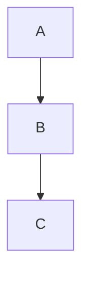
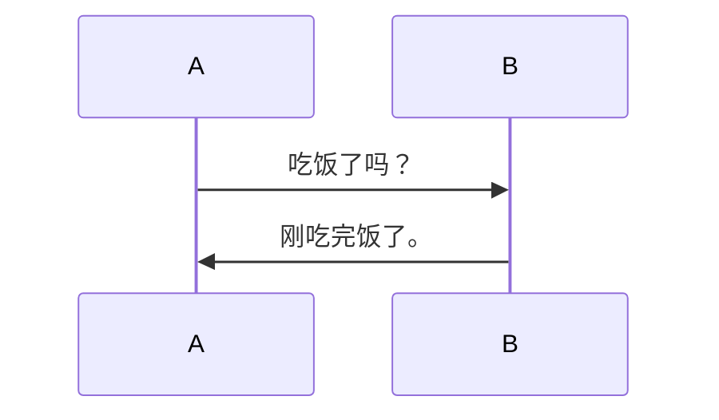
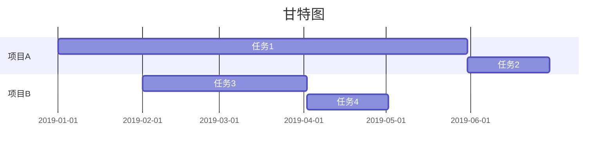

鑫鑫又给大家带来了满满的干货~

Markdown编辑器下载请自行去谷歌~

## 1.文本框

```markdown
```tex

Hello World
```

效果如下：

```tex
Hello World
```

## 2.表格

### 一、基本用法

```markdown
First Header | Second Header | Third Header
------------ | ------------- | ------------
Content Cell | Content Cell  | Content Cell
Content Cell | Content Cell  | Content Cell
```

效果如下：

| First Header | Second Header | Third Header |
| ------------ | ------------- | ------------ |
| Content Cell | Content Cell  | Content Cell |
| Content Cell | Content Cell  | Content Cell |

### 二、进阶用法

```markdown
First Header | Second Header | Third Header |
:----------- | :-----------: | -----------: |
Left         | Center        | Right        |
Left         | Center        | Right        |
```

效果如下：

| First Header | Second Header | Third Header |
|:------------ |:-------------:| ------------:|
| Left         | Center        | Right        |
| Left         | Center        | Right        |

## 3.数学公式

首先确保你的Markdown编辑器支持并且已经可以使用LaTeX语法。

如果想让公式插在文字中，可以使用`$`，例如`\$x^2\$`，就是$x^2$。

### 一、上下标

> ^ 表示上标, _ 表示下标。如果上下标的内容多于一个字符，需要用 {} 将这些内容括成一个整体。上下标可以嵌套，也可以同时使用。

```latex
x^{y^z}=(1+{\rm e}^x)^{-2xy^w}
```

效果如下：

$$
x^{y^z}=(1+{\rm e}^x)^{-2xy^w}
$$

### 二、括号与分隔符

> `()`、`[]`和`|`表示符号本身，使用`{}`来表示`{}`。当要显示大号的括号或分隔符时，要用`\left`和`\right`命令。

| 输入        | 显示        | 输入        | 显示        |
|:---------:|:---------:|:---------:|:---------:|
| `\langle` | $\langle$ | `\rangle` | $\rangle$ |
| `\lceil`  | $\lceil$  | `\rceil`  | $\rceil$  |
| `\lfloor` | $\lfloor$ | `\rfloor` | $\rfloor$ |
| `\lbrace` | $\lbrace$ | `\rbrace` | $\rbrace$ |
| `\lvert`  | $\lvert$  | `\rvert`  | $\rvert$  |

```latex
f(x,y,z) = 3y^2z \left( 3+\frac{7x+5}{1+y^2} \right)
```

效果如下：

$$
f(x,y,z) = 3y^2z \left( 3+\frac{7x+5}{1+y^2} \right)
$$

### 三、分数

> 通常使用`\frac {分子} {分母}`命令产生一个分数，分数可嵌套。
> 
> 便捷情况可直接输入`\frac ab`来快速生成一个↓

$$
\frac ab
$$

> 如果分式很复杂，亦可使用`分子 \over 分母`命令，此时分数仅有一层。

```latex
\frac{a-1}{b-1} \quad and \quad {a+1\over b+1}
```

效果如下：

$$
\frac{a-1}{b-1} \quad and \quad {a+1\over b+1}
$$

### 四、开方

> 使用`\sqrt [根指数，省略时为2] {被开方数}`命令输入开方。

```latex
\sqrt{2} \quad and \quad \sqrt[n]{3}
```

效果如下：

$$
\sqrt{2} \quad and \quad \sqrt[n]{3}
$$

### 五、省略号

> 数学公式中常见的省略号有两种，`\ldots`表示与文本底线对齐的省略号，`\cdots`表示与文本中线对齐的省略号。

```latex
f(x_1,x_2,{\ldots} ,x_n) = x_1^2 + x_2^2 + {\cdots} + x_n^2
```

效果如下：

$$
f(x_1,x_2,{\ldots} ,x_n) = x_1^2 + x_2^2 + {\cdots} + x_n^2 
$$

### 六、矢量

> 使用`\vec{矢量}`来自动产生一个矢量。也可以使用`\overrightarrow`等命令自定义字母上方的符号。

```latex
\overleftarrow{x \cdot y} \quad and \quad \overleftrightarrow{xy} \quad and \quad \overrightarrow{xy}
```

效果如下：

$$
\overleftarrow{x \cdot y} \quad and \quad \overleftrightarrow{xy} \quad and \quad \overrightarrow{xy} 
$$

### 七、矩阵

#### Ⅰ 无框矩阵

> 在开头使用`begin{matrix}`，在结尾使用`end{matrix}`，在中间插入矩阵元素，每个元素之间插入`&` ，并在每行结尾处使用`\` 。

```latex
\begin{matrix}

1 & x & x^2 \\

1 & y & y^2 \\

1 & z & z^2 \\

\end{matrix}
```

效果如下：

$$
\begin{matrix}

1 & x & x^2 \\

1 & y & y^2 \\

1 & z & z^2 \\

\end{matrix}
$$

#### Ⅱ 边框矩形

> 在开头将`matrix`替换为`pmatrix` `bmatrix` `Bmatrix` `vmatrix` `Vmatrix`。

```latex
\begin{matrix} 1 & 2 \\ 3 & 4 \\ \end{matrix}

\begin{pmatrix} 1 & 2 \\ 3 & 4 \\ \end{pmatrix}

\begin{bmatrix} 1 & 2 \\ 3 & 4 \\ \end{bmatrix}

\begin{Bmatrix} 1 & 2 \\ 3 & 4 \\ \end{Bmatrix}

\begin{vmatrix} 1 & 2 \\ 3 & 4 \\ \end{vmatrix}

\begin{Vmatrix} 1 & 2 \\ 3 & 4 \\ \end{Vmatrix}
```

效果如下：

$$
\begin{matrix} 1 & 2 \\ 3 & 4 \\ \end{matrix}

\begin{pmatrix} 1 & 2 \\ 3 & 4 \\ \end{pmatrix}

\begin{bmatrix} 1 & 2 \\ 3 & 4 \\ \end{bmatrix}

\begin{Bmatrix} 1 & 2 \\ 3 & 4 \\ \end{Bmatrix}

\begin{vmatrix} 1 & 2 \\ 3 & 4 \\ \end{vmatrix}

\begin{Vmatrix} 1 & 2 \\ 3 & 4 \\ \end{Vmatrix}
$$

**PS**：输入`<br>`，可以实现加入空行。

### 八、常用符号

以下是一些常用符号。

#### Ⅰ 转义字符

| 符号           | 命令           | 符号    | 命令      | 符号      | 命令      |
|:------------:| ------------ |:-----:| ------- |:-------:| ------- |
| \$           | `\$`         | $\%$  | `\%`    | $\{$    | `\{`    |
| $\_$         | `\_`         | $\}$  | `\}`    | $\#$    | `\#`    |
| $\&$         | `\&`         | $\^A$ | `\^{A}` | $\~{A}$ | `\~{A}` |
| $\backslash$ | `\backslash` |       |         |         |         |

#### Ⅱ 希腊字母

| 符号         | 命令         | 符号            | 命令            | 符号          | 命令          |
|:----------:| ---------- |:-------------:| ------------- |:-----------:| ----------- |
| $\alpha$   | `\alpha`   | $\beta$       | `\beta`       | $\gamma$    | `\gamma`    |
| $\Gamma$   | `\Gamma`   | $\delta$      | `\delta`      | $\Delta$    | `\Delta`    |
| $\epsilon$ | `\epsilon` | $\varepsilon$ | `\varepsilon` | $\zeta$     | `\zeta`     |
| $\eta$     | `\eta`     | $\theta$      | `\theta`      | $\vartheta$ | `\vartheta` |
| $\iota$    | `\iota`    | $\kappa$      | `\kappa`      | $\Theta$    | `\Theta`    |
| $\lambda$  | `\lambda`  | $\mu$         | `\mu`         | $\nu$       | `\nu`       |
| $\xi$      | `\xi`      | $\Xi$         | `\Xi`         | $\pi$       | `\pi`       |
| $\Pi$      | `\Pi`      | $o$           | `o`           | $O$         | `O`         |
| $\rho$     | `\rho`     | $\varrho$     | `\varrho`     | $\sigma$    | `\sigma`    |
| $\Sigma$   | `\Sigma`   | $\tau$        | `\tau`        | $\upsilon$  | `\upsilon`  |
| $\phi$     | `\phi`     | $\varphi$     | `\varphi`     | $\chi$      | `\chi`      |
| $\psi$     | `\psi`     | $\Psi$        | `\Psi`        | $\omega$    | `\omega`    |
| $\Omega$   | `\Omega`   | $\Phi$        | `\Phi`        | $\Upsilon$  | `\Upsilon`  |

#### Ⅲ 字形设置

| 示例                  | 命令                  | 说明          |
|:-------------------:|:-------------------:| ----------- |
| $\boxed{text}$      | `\boxed{text}`      | 添加边框\(手写体\) |
| $\fbox{text}$       | `\fbox{text}`       | 添加边框\(印刷体\) |
| $\mathbf{text}$     | `\mathbf{text}`     | 字体加粗        |
| $\boldsymbol{text}$ | `\boldsymbol{text}` | 斜体加粗        |
| $A \large{A}$       | `\large{A}`         | 放大字体        |
| $A \small{A}$       | `\small{A}`         | 缩小字体        |

#### Ⅳ 其他

| 符号                    | 命令                    | 符号                   | 命令                   | 符号                | 命令                |
|:---------------------:| --------------------- |:--------------------:| -------------------- |:-----------------:| ----------------- |
| $\times$              | `\times`              | $\div$               | `\div`               | $\mp$             | `\mp`             |
| $\otimes$             | `\otimes`             | $\oplus$             | `\oplus`             | $\odot$           | `\odot`           |
| $\oslash$             | `\oslash`             | $\triangle$          | `\triangle`          | $\neq$            | `\neq`            |
| $\equiv$              | `\equiv`              | $\pm$                | `\pm`                | $\ominus$         | `\ominus`         |
| $\le$                 | `\le`                 | $<$                  | `<`                  | $>$               | `>`               |
| $\ge$                 | `\ge`                 | $\cup$               | `\cup`               | $\bigcup$         | `\bigcup`         |
| $\bigotimes$          | `\bigotimes`          | $\bigcirc$           | `\bigcirc`           | $\vee$            | `\vee`            |
| $\bigvee$             | `\bigvee`             | $\sqcap$             | `\sqcap`             | $\subset$         | `\subset`         |
| $\subseteq$           | `\subseteq`           | $\setminus$          | `\setminus`          | $\parallel$       | `\parallel`       |
| $\propto$             | `\propto`             | $\forall$            | `\forall`            | $\aleph$          | `\aleph`          |
| $\ell$                | `\ell`                | $\uplus$             | `\uplus`             | $\cap$            | `\cap`            |
| $\bigcap$             | `\bigcap`             | $\bigoplus$          | `\bigoplus`          | $\amalg$          | `\amalg`          |
| $\wedge$              | `\wedge`              | $\bigwedge$          | `\bigwedge`          | $\sqcup$          | `\sqcup`          |
| $\supset$             | `\supset`             | $\supseteq$          | `\supseteq`          | $\mid$            | `\mid`            |
| $\neg$                | `\neg`                | $\exists$            | `\exists`            | $\nabla$          | `\nabla`          |
| $\partial$            | `\partial`            | $\biguplus$          | `\biguplus`          | $\ast$            | `\ast`            |
| $\circ$               | `\circ`               | $\to$                | `\to`                | $\lhd$            | `\lhd`            |
| $\unlhd$              | `\unlhd`              | $\prec$              | `\prec`              | $\sim$            | `\sim`            |
| $\cong$               | `\cong`               | $\ll$                | `\ll`                | $\in$             | `\in`             |
| $\ldots$              | `\ldots`              | $\vdots$             | `\vdots`             | $\imath$          | `\imath`          |
| $\int$                | `\int`                | $\star$              | `\star`              | $\bullet$         | `\bullet`         |
| $\infty$              | `\infty`              | $\rhd$               | `\rhd`               | $\unrhd$          | `\unrhd`          |
| $\succ$               | `\succ`               | $\approx$            | `\approx`            | $\doteq$          | `\doteq`          |
| $\gg$                 | `\gg`                 | $\notin$             | `\notin`             | $\cdots$          | `\cdots`          |
| $\ddots$              | `\ddots`              | $\jmath$             | `\jmath`             | $\oint$           | `\oint`           |
| $\triangleleft$       | `\triangleleft`       | $\bigtriangleup$     | `\bigtriangleup`     | $\uparrow$        | `\uparrow`        |
| $\leftarrow$          | `\leftarrow`          | $\Leftarrow$         | `\Leftarrow`         | $\longleftarrow$  | `\longleftarrow`  |
| $\Longleftarrow$      | `\Longleftarrow`      | $\leftrightarrow$    | `\leftrightarrow`    | $\searrow$        | `\searrow`        |
| $\leftharpoonup$      | `\leftharpoonup`      | $\leftharpoondown$   | `\leftharpoondown`   | $\swarrow$        | `\swarrow`        |
| $\nwarrow$            | `\nwarrow`            | $\rightleftharpoons$ | `\rightleftharpoons` | $\diamond$        | `\diamond`        |
| $\heartsuit$          | `\heartsuit`          | $\spadesuit$         | `\spadesuit`         | $\triangleright$  | `\triangleright`  |
| $\bigtriangledown$    | `\bigtriangledown`    | $\downarrow$         | `\downarrow`         | $\rightarrow$     | `\rightarrow`     |
| $\Rightarrow$         | `\Rightarrow`         | $\nearrow$           | `\nearrow`           | $\Longrightarrow$ | `\Longrightarrow` |
| $\longleftrightarrow$ | `\longleftrightarrow` | $\S$                 | `\S`                 | $\rightharpoonup$ | `\rightharpoonup` |
| $\rightharpoondown$   | `\rightharpoondown`   | $\diamondsuit$       | `\diamondsuit`       | $\longrightarrow$ | `\longrightarrow` |
| $\Leftrightarrow$     | `\Leftrightarrow`     | $\angle$             | `\angle`             | $\clubsuit$       | `\clubsuit`       |
| $\Longleftrightarrow$ | `\Longleftrightarrow` | $\because$           | `\because`           | $\therefore$      | `\therefore`      |
| $\log$                | `\log`                | $\bot$               | `\bot`               | $\sin$            | `\sin`            |
| $\cos$                | `\cos`                | $\tan$               | `\tan`               | $\cot$            | `\cot`            |
| $\sec$                | `\sec`                | $\csc$               | `\csc`               | $\lg$             | `\lg`             |
| $\ln$                 | `\ln`                 |                      |                      |                   |                   |

### 九、在GitHub上使用LaTeX语法

了解了这么多LaTeX语法，在[GitHub](https://github.com)上不能敲，这可咋整？

所以这个时候就要请出[Codecogs](https://latex.codecogs.com/)了！

但进去一看，emm...这好像也没啥用啊！


不不不，你需要调用另外一个Codecogs网址：https://latex.codecogs.com/gif-latex? + LaTeX语法代码，然后用Markdown图片语法显示。

例如：

```latex

```

效果如下：


哦对了，本博客已经在全站头部文件引入了[MathJax](https://www.mathjax.org)，所以不需要使用Codecogs。

Codecogs的效果没有MathJax好，清晰度比MathJax低，肉眼可见。

**PS**：空格需要替换为`%20`

## 4.代码

```markdown
```python

print('Hello,World!')
```

效果如下：

```python
print('Hello,World!')
```

## 5.短代码

如果有个函数或者片段代码，可以使用反引号(`)把它括起来。

```markdown
`<br>`
```

效果如下：

`<br>`

## 6.内联图片

```markdown

```

效果如下：


## 7.超链接

```markdown
[MacWinLin工作室博客](https://macwinlin.github.io)
```

效果如下：

[MacWinLin工作室博客](https://macwinlin.github.io)

## 8.待办列表

```markdown
- [x] 上学

- [ ] 不上学
```

效果如下：

- [x] 1

- [ ] 2

## 9.标题

```markdown
# 一级标题

## 二级标题

### 三级标题

#### 四级标题

##### 五级标题

###### 六级标题
```

效果……懒得试了请自行前往[我的云盘](https://drive.xinxin2021.tk/zh-CN/BLOG/%E6%A0%87%E9%A2%98%E5%AE%9E%E9%AA%8C%E6%95%88%E6%9E%9C.zip)或访问[蓝奏云链接](https://xinxinf.lanzouq.com/iibwsxqmk9a)。

## 10.段落

没错，你看到的这行字也是段落。

```markdown
一个段落
```

效果如下：

一个段落

没错，就这么简单。

### 注意事项

换行请在两个段落之间空一行，或在段落后加2个空格；

否则两行将被识别为一行。

## 11.加粗、斜体和删除线

越来越像复杂版Word了……

### 一、加粗

```markdown
This is **bold**.
```

效果如下：

This is **bold**.

### 二、斜体

```markdown
This is *italic*.
```

效果如下：

This is *italic*.

**不过这样也是可以的**：

```markdown
This is _italic_
```

效果和上面的一模一样，选择哪个看你自己。

### 三、斜体并加粗

```markdown
This is **_bold and italic_**.
```

效果如下：

This is **_bold and italic_**.

**注意**：`***bold and italic***`也是可行的，但建议使用`**_bold and italic_**`，除非这个用不了。

### 四、删除线

```markdown
This is ~~delete~~
```

效果如下：

This is ~~delete~~.

## 12.列表

列表分为有序列表和无序列表。

### 一、有序列表

要创建有序列表，请在每个列表项前添加数字并紧跟一个英文句点。 数字不必按数学顺序排列，但是列表应当以数字 1 起始。

```markdown
1. First item

2. Second item

3. Third item

4. Fourth item
```

效果如下：

1. First item

2. Second item

3. Third item

4. Fourth item

### 二、无序列表

要创建无序列表，请在每个列表项前面添加破折号 (-)、星号 (*) 或加号 (+) 。 缩进一个或多个列表项可创建嵌套列表。

```markdown
- First item

- Second item

- Third item

- Fourth item
```

效果如下：

- First item

- Second item

- Third item

- Fourth item

## 13.引用

```markdown
> Number One
```

效果如下：

> Number One

### 一、多个段落一起引用

可以一起引用多个段落。

```markdown
> First item
>
> Second item
```

效果如下：

> First item
> 
> Second item

### 二、嵌套

引用也可以嵌套，在嵌套的段落前加上\>\>即可

```markdown
> First item
>
> > Second item
```

效果如下：

> First item
> 
> > Second item

### 三、引用其他元素

引用可以包含其他 Markdown 格式的元素。 并非所有元素都可以使用，你需要进行实验以查看哪些元素有效。

```markdown
> #### 标题
>
> - Frist item
> - Second item
> - Third item
>
> *italic*&**bold**
>
> ***bold and italic***
```

效果如下：

> #### 标题
> 
> - Frist item
> - Second item
> - Third item
> 
> *italic*&**bold**
> 
> ***bold and italic***

## 14.分隔线

要创建分隔线，请在单独一行上使用三个或多个星号 (\*\*\*)、破折号 (\-\-\-) 或下划线 (\_\_\_) ，并且不能包含其他内容。

```markdown
*********

---------

_________
```

效果如下：

*********

---------

_________

## 15.转义字符

要显示原本用于格式化 Markdown 文档的字符，请在字符前面添加反斜杠字符 \ 。

```markdown
\* 如果没有反斜杠，这是一个无序列表。
```

效果如下：

\* 如果没有反斜杠，这是一个无序列表。

### 可做转义的字符

以下列出的字符都可以通过使用反斜杠字符从而达到转义目的。

- **\\**

- **\`**

- **\***

- **\_**

- **\{\}**

- **\[\]**

- **\(\)**

- **\#**

- **\-**

- **\.**

- **\!**

- **\|**

## 16.折叠内容

根据Markdown中可以嵌套HTML语法的特性，我们可以做出折叠文本。

### 一、折叠文本

```html
<details>

<summary>折叠文本</summary>

1+1=1

2+2=4

</details>
```

效果如下：

<details>

<summary>折叠文本</summary>

1+1=1

2+2=4

</details>

### 二、折叠代码块

```html
<details>

<summary>折叠代码块</summary>

<pre><blockcode>

System.out.println('折叠的代码块')

</blockcode></pre>

</details>
```

效果如下：

<details>

<summary>折叠代码块</summary>

<pre><blockcode>

System.out.println('折叠的代码块')

</blockcode></pre>

</details>

## 17.Mermaid语法

Mermaid真神奇，这仅仅只是一部分Mermaid语法而已。

### 一、流程图

```tex


效果如下：

<div class="mermaid">
  graph TD;
  A-->B;
  B-->C;
</div>

### 二、序列图

```tex


效果如下：

<div class="mermaid">
  sequenceDiagram
  A->> B: 吃饭了吗？
  B->> A: 刚吃完饭了。
</div>

### 三、甘特图

```tex


效果如下：

<div class="mermaid">
  gantt
  title 甘特图
  dateFormat YYYY-MM-DD
  section 项目A
  任务1 :a1, 2019-01-01, 150d
  任务2 :after a1, 30d
  section 项目B
  任务3 :2019-02-01, 60d
  任务4 :30d
</div>

### 博客的Mermaid

**此部分与Markdown学习无关**

我这个博客，在很长的一段时间（从博客建立〔2021.7〕到2023.4）里，都没有Mermaid。因为当时不熟悉博客的代码结构，就是套模板，因此一直都没加[Mermaid.js](https://mermaid.js.org)。

后来，我开始了解代码结构，最开始是[Lemon的博客](https://lemonchann.github.io)，按着TA的教程整了一个博客，后来好像又整了一个[Gridea](https://open.gridea.dev/)（2022.1——？），但是好像因为网络问题同步不到[GitHub](https://github.com)，犹豫了好久最终决定放弃。

然后就是这个模板，其实Lemon的博客也是根据这个模板改的。[LOFFER](https://fromendworld.github.io/LOFFER/)，改了主题色，根据Lemon的教程加搜索框，加社交链接图标，加网站计数。LOFFER自带MathJax了，我后来在全站头部文件里又引入了Mermaid.js。

很漫长，没想到跌跌撞撞已经一年半多了。（2023.4.24）

***完***

---

[](https://creativecommons.org/licenses/by-nc/4.0/deed.zh)

本文章及其引用的图片采用[CC-BY-NC 4.0国际](https://creativecommons.org/licenses/by-nc/4.0/deed.zh)许可协议进行许可(不包括引用的知识共享许可证徽章)。

[联系作者](mailto:blog@xinxin2021.tk) · [侵权联系](mailto:tort@xinxin2021.tk) —— 分享 · [QZone](https://sns.qzone.qq.com/cgi-bin/qzshare/cgi_qzshare_onekey?url=https%3A%2F%2Fblog.xinxin2021.tk%2Fmarkdown%2F&title=Markdown%E5%85%A5%E9%97%A8%E6%95%99%E7%A8%8B-%E6%8C%81%E7%BB%AD%E6%9B%B4%E6%96%B0&site=%E9%91%AB%E5%8D%9A%E5%AE%A2) · [Weibo](https://service.weibo.com/share/share.php?url=https%3A%2F%2Fblog.xinxin2021.tk%2Fmarkdown%2F&count=1&title=Markdown%E5%85%A5%E9%97%A8%E6%95%99%E7%A8%8B-%E6%8C%81%E7%BB%AD%E6%9B%B4%E6%96%B0&language=zh_cn)
